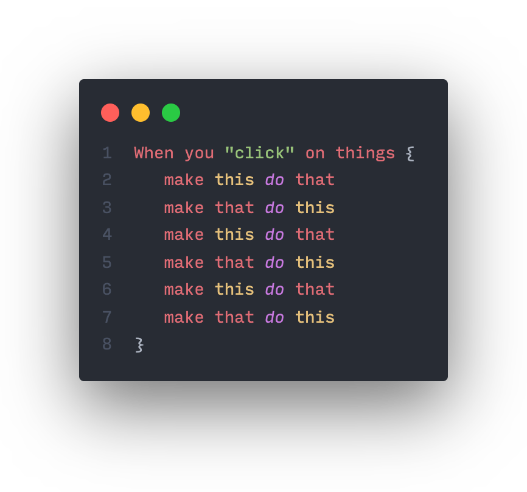

Event Listeners in javascript
-----------------------------
An standard example demonstrating the use of Event listeners (globally) in Javascript. When using Event Listeners globally you can use ```event.target.matches``` to "listen" for events executed on **multiple HTML elements** at the same time, all in one go! This makes it easier to set up Event Listeners in your HTML document or app. 

You simply set up a global Event Listener for one particular event, like mouse clicks, and then identify elements to be manipulated by HTML name, CSS class or CSS ID) <br>

##Edit in online editor:
Edit / Play around with the code for yourself in **CodeSandBox**! > See link below:
https://githubbox.com/davidvandenbor/Event-Listeners-in-Javascript



